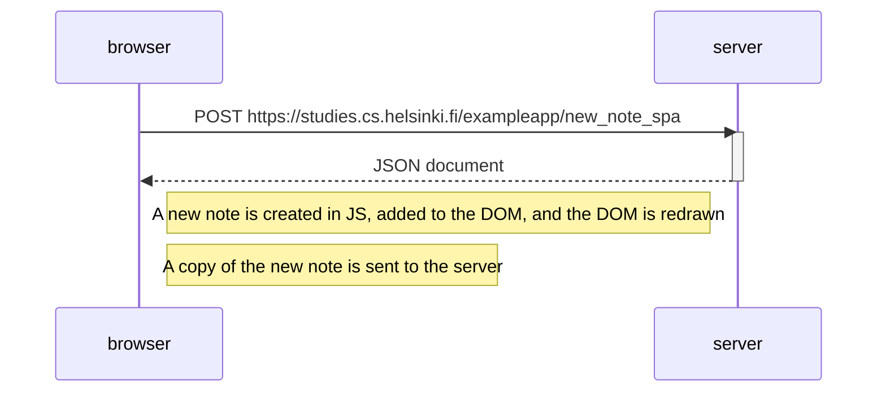

```mermaid
sequenceDiagram
    participant browser
    participant server

    browser->>server: POST https://studies.cs.helsinki.fi/exampleapp/new_note_spa
    activate server
    server-->>browser: JSON document
    deactivate server
    
    Note right of browser: A new note is created in JS, added to the DOM, and the DOM is redrawn
    Note right of browser: A copy of the new note is sent to the server
```
